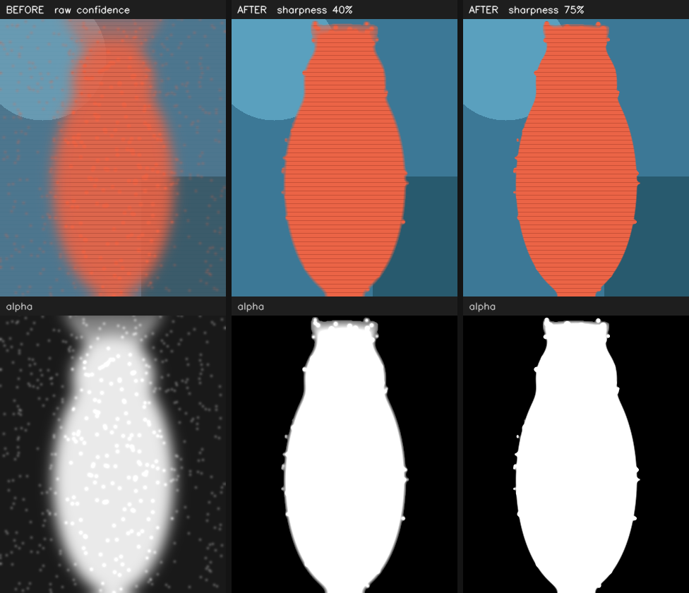

# Mob Cam — desktop setup

Turns an Android phone into a webcam **and** a microphone for the desktop. Video
arrives over `adb forward` on TCP 4343, audio on TCP 4344, and the desktop
publishes each as a real OS device so Zoom, Meet, Teams, OBS and browsers can
select them independently.

## Architecture

```
phone camera                                         phone microphone
    │  (Use PC OFF) phone applies effects                 │  (mic toggle on)
    │  (Use PC ON)  raw upright JPEG                      │  20 ms PCM chunks
    ▼                                                     ▼
data_receiver.py                                  audio_receiver.py
  typed message stream, handshake, JPEG decode      format handshake, no buffer
    │                                                     │
    ▼                                                     ▼
image_processing.py                               audio_processing.py
  rotate → mirror → color_filter → head_lock        mute → dc_block → gain
  → background → blur → crop_shape → fit_output     → limiter → meter
  → shape_mask                                            │
  (AI stages call into ai_processing.py)                  │
    ├────────► receiver_gui.py  preview window            │
    ▼                                                     ▼
virtual_camera.py                                 audio_output.py
  pyvirtualcam → real OS camera device              resample → loopback device
    ▼                                              virtual_mic.py creates it
                                                          ▼
        Zoom / Meet / Teams / OBS / browsers  ────────────┘
```

`stream_pipeline.py` wires both halves together and owns the threads.
`protocol.py` is the wire format, shared with the Android `FrameStreamer` and
`AudioStreamer`.

The two paths are deliberately independent: separate sockets, separate threads,
separate OS devices. Audio never queues behind a JPEG, and a failure in one
cannot take the other down.

## Handshake

**Video, port 4343**

```
phone → HELLO       every setting as JSON, including the Use PC flag
phone → BACKGROUND  the selected background image, when Use PC is on
PC    → ACK         models loaded, output size negotiated
phone → FRAME ...   frames, only after the ACK
```

**Audio, port 4344**

```
phone → HELLO       sampleRate, channels, encoding, chunkBytes
PC    → ACK         output device open at a matching format
phone → AUDIO ...   raw PCM, 20 ms per chunk
```

The phone starts sending anyway after a timeout (4 s video, 3 s audio), so an
older desktop build still works. Bare length-prefixed JPEGs from an older APK
are also still accepted — the receiver sniffs the first byte to tell the two
formats apart.

When Use PC is off, the desktop applies geometry only; the colour and AI stages
pass through so effects are never applied twice.

## Install

```
pip install -r requirements.txt
```

`sounddevice` needs PortAudio. It ships bundled on Windows and macOS; on
Debian or Ubuntu install it first:

```
sudo apt install libportaudio2
```

## Camera device, per OS

The OS is detected at runtime. You still need the loopback driver once.

**Windows** — install [OBS Studio](https://obsproject.com) and launch it once to
register the OBS Virtual Camera driver. OBS does not need to stay open.

**macOS** — install OBS Studio 26.1+, open it once, click **Start Virtual
Camera**, then allow the camera extension in System Settings → Privacy & Security.

**Linux**

```
sudo apt install v4l2loopback-dkms v4l-utils linux-headers-$(uname -r)
sudo modprobe v4l2loopback devices=1 video_nr=10 \
     card_label='Mob Cam' exclusive_caps=1
```

The GUI's **Load driver** button runs this for you via `pkexec`.

`exclusive_caps=1` is not optional. Without it the device advertises itself as
both an output and a capture device, and browsers list only pure capture
devices — the camera then appears in OBS but not in Chrome, Firefox or Meet.

Two things that make this confusing:

- `modprobe` will **not** change the options of an already-loaded module. To add
  `exclusive_caps` you must `sudo modprobe -r v4l2loopback` first. The GUI's
  button becomes **Reload driver** and handles this when it detects the state.
- Chrome enumerates cameras only when a page loads. Start Mob Cam *before*
  opening or reloading the Meet tab.

The module does not survive a reboot unless persisted via
`/etc/modules-load.d/` and `/etc/modprobe.d/`.

## Microphone device, per OS

**Windows** — install [VB-CABLE](https://vb-audio.com/Cable/). Set *Send audio
to* → `CABLE Input`, and in your conferencing app pick the microphone
`CABLE Output`. The names differ on purpose: Mob Cam writes to one end of the
cable, the app listens at the other.

**macOS** — `brew install blackhole-2ch`, then pick `BlackHole 2ch` on both
sides.

**Linux** — click **Create virtual mic**, or run:

```
pactl load-module module-null-sink sink_name=mobcam_sink \
      sink_properties=device.description=Mob_Cam_Output
pactl load-module module-remap-source master=mobcam_sink.monitor \
      source_name=mobcam_mic \
      source_properties=device.description=Mob_Cam_Microphone
```

Your app then records from **Mob Cam Microphone**. The remap step matters: a
bare null sink only produces "Monitor of …", which most applications hide.

Do not select your sound card as the target. Audio sent there is audible but no
application can record from it. Add both `load-module` lines to
`~/.config/pulse/default.pa` to keep the device across logins.

Sound cards typically accept only 44.1 or 48 kHz, so `audio_output.py`
negotiates a rate the device will take and resamples — the phone can stay on
16 kHz regardless. Linear interpolation, with phase carried across chunk
boundaries so the 20 ms seams do not click. Fine for speech, not for music.

## Audio format and processing

The phone picks the capture format; long-press the mic button to change it.

| Option | Rate | Channels |
| --- | --- | --- |
| Voice (default) | 16 kHz | mono |
| Wide | 44.1 kHz | mono |
| Full | 48 kHz | mono |
| Stereo | 48 kHz | stereo |

Capture uses `VOICE_COMMUNICATION`, which engages the platform echo canceller,
noise suppressor and AGC — worth having, since the phone usually sits next to
the PC speakers. It falls back to `MIC` where that source is unavailable.

Desktop-side the GUI offers mic gain (−12 to +24 dB), mute, a live input level
meter, and a speaker monitor for testing. Buffering is capped at 80 ms and drops
the oldest bytes rather than queueing; underruns fill with silence.

## AI models

Downloaded on first use into `~/.mobcam/models`, or set `MOBCAM_MODEL_DIR`. A
`models/` folder next to the scripts is checked first, so an existing
`selfie_segmenter_landscape.tflite` can be dropped there and will be used as-is.

| Purpose | File |
| --- | --- |
| Segmentation, best quality | `selfie_multiclass_256x256.tflite` |
| Segmentation, fastest | `selfie_segmenter_landscape.tflite` |
| Face tracking | `blaze_face_short_range.tflite` |

Pick the segmentation model in the GUI's Phone panel. If mediapipe or a model is
missing, face tracking falls back to an OpenCV Haar cascade and segmentation
switches off — frames keep flowing either way, and the reason shows in the AI
status line.

Desktop-only quality gains over the phone pipeline: full-resolution compositing,
temporal mask smoothing to stop edge flicker, guided-filter edge refinement
(install `opencv-contrib-python` to enable it, otherwise a bilateral filter is
used), a real separable background blur, and synchronous face tracking with no
one-frame lag.

### Edge sharpness

The **Cut-out edge** slider controls how hard the segmentation mask edge is.
Low values feather the boundary, which hides mask error but leaves a visible
halo; high values keep hair and shoulders crisp at the cost of showing any
jitter in the mask.



It is live — adjust it while streaming and judge it in the preview window.

## Output resolution

A camera device advertises one resolution for as long as it is open, so the
format is fixed at open time and every frame is letterboxed to fit. Changing the
resolution in the GUI reopens the device — apps already consuming the feed need
to reselect the camera. Odd pixel sizes are rounded down to even, since some
drivers' YUV conversion breaks on odd dimensions.

## Adding a processing stage

Video:

```python
def blur_background(frame, config):
    ...
    return frame

stream.pipeline.insert_before("fit_output", "blur_bg", blur_background)
```

Per-frame scratch shared between stages goes in `config.frame_state`, which is
cleared each frame — that is how `background` and `blur` share one segmentation
pass.

Audio, in `audio_processing.py`, follows the same shape: add a method and one
line in `AudioPipeline.process`. Stages receive a float32 array of shape
`(frames, channels)` and must return the same. Anything needing a window longer
than 20 ms has to carry its own state across calls, as `_DcBlock` does, rather
than waiting for more samples.

Stages that raise are logged and skipped, in both pipelines.

## Testing without a phone

```
python3 test_audio.py            # fake phone streams a tone through the real path
python3 test_audio.py --server   # leave it running, connect the real GUI
```

Other suites: `test_full`, `test_phone_mode`, `test_fixes`, `test_realtime`,
`test_before_after`, `test_sharpness`, `test_resize`, `test_settings`,
`test_download`, `test_nv21`, `test_ratelimit`, `test_gui_persist` (needs a
display).

## Troubleshooting

| Symptom | Cause |
| --- | --- |
| Camera works in OBS, not in Meet | `exclusive_caps=1` missing — reload the driver |
| Camera missing after reboot | `v4l2loopback` not made permanent |
| Camera not listed in a Meet tab | Chrome enumerated before Mob Cam started; reload the tab |
| Camera checkbox will not stay on | Fixed — a probe failure no longer persists as a preference |
| Audio plays on speakers instead of reaching apps | Sound card selected instead of a loopback device |
| `Invalid sample rate [PaErrorCode -9997]` | Device refuses the phone's rate; handled by resampling now |
| Only "Monitor of …" shows in the app | `module-remap-source` not loaded |
| Preview works but nothing else does | Preview bypasses both devices — check the two panels |